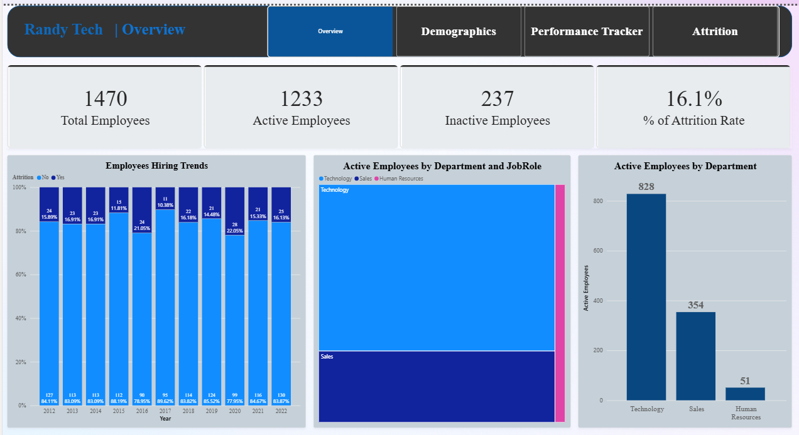
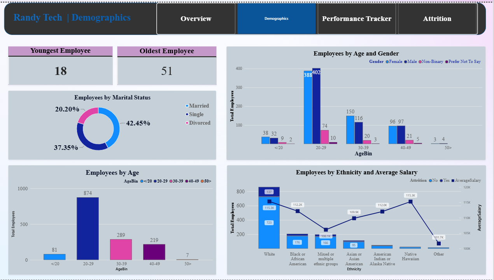
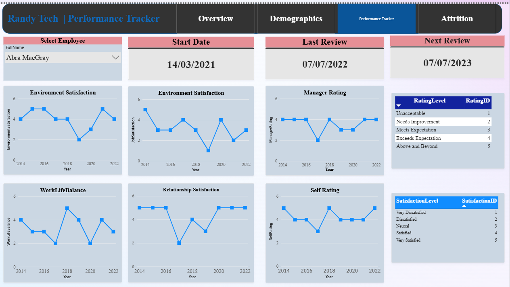
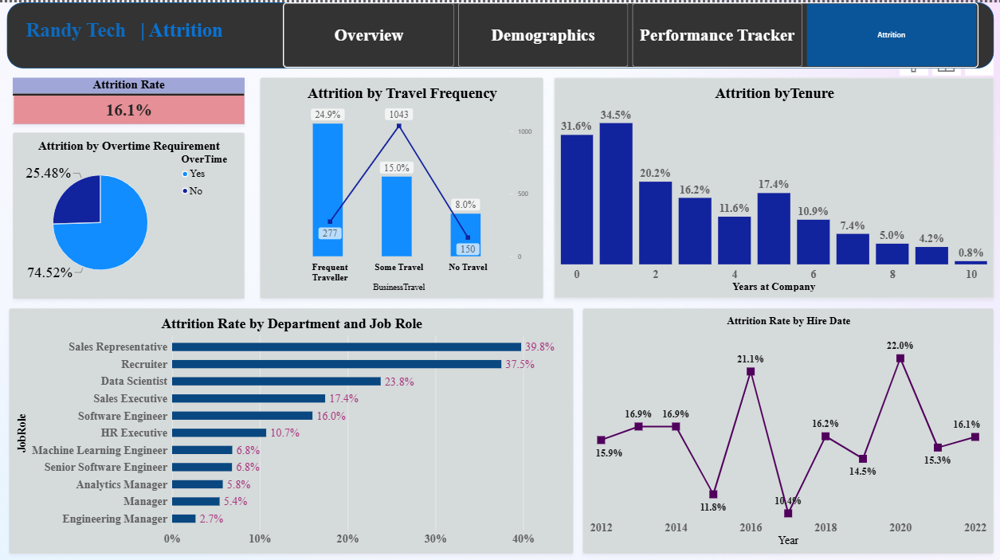

# HR Analytics — Power BI Dashboard

This project presents an interactive Power BI dashboard designed to analyze workforce dynamics and employee 
	attrition across a mid-sized organization. The dashboard provides a clear and structured view of key HR metrics,
	enabling HR business partners and senior leadership to quickly understand headcount trends, demographic composition, 
								individual performance trajectories, and the key drivers behind employee turnover. 
---

## Dashboard Preview

> Open `HR_Analytics.pbix` in **Power BI Desktop** to interact with the full report.

| Page | Focus |
|---|---|
| Overview | Headcount KPIs and department-level workforce snapshot |
| Demographics | Age, gender, ethnicity, marital status, and salary distributions |
| Performance Tracker | Employee-level review history and satisfaction trends over time |
| Attrition | Attrition rate drivers by role, tenure, travel, and overtime |

---

## Business Questions Answered

- How many employees are currently active vs. inactive, and what is the overall attrition rate?
- How does headcount vary by department and job role?
- What is the age and gender distribution of the workforce, and how does it differ across roles?
- How does average salary compare across ethnic groups?
- For any individual employee — when was their last review, when is the next one due, and how have their satisfaction scores trended over time?
- Which departments, job roles, and tenure bands carry the highest attrition risk?
- Does overtime or business travel frequency correlate with higher attrition?

---

## Report Pages

### 1. Overview
Provides an executive-level snapshot of the workforce.

**KPIs:** Active Employees · Inactive Employees · Total Employees · % Attrition Rate
**Visuals:**
- 100% stacked column chart — employee headcount over time, segmented by attrition status
- Clustered column chart — active employees by department
- Treemap — active employees drilled down by department → job role

---

### 2. Demographics
Explores the composition of the workforce across personal and social dimensions.

**KPIs:** Youngest Employee Age · Oldest Employee Age
**Visuals:**
- Clustered column chart — employee count by age band
- Clustered column chart — employee count by age band, split by gender
- Donut chart — employee breakdown by marital status
- Combo chart — total employees and average salary by ethnicity, with attrition overlay

---

### 3. Performance Tracker
Supports HR business partners in monitoring individual employees over time.

**Slicer:** Employee name (FullName) — filters all visuals to a single person

**KPIs:** Hire Date · Last Review Date · Next Review Date

**Trend lines (by year):**
- Environment Satisfaction
- Relationship Satisfaction
- Work-Life Balance
- Job Satisfaction
- Manager Rating
- Self Rating

**Reference tables:** Satisfaction level scale · Performance rating scale

---

### 4. Attrition
Surfaces the drivers of employee turnover to support retention strategy.

**KPI:** Overall % Attrition Rate

**Visuals:**
- Clustered bar chart — % attrition rate by department and job role
- Line chart — attrition rate trend over time (date hierarchy)
- Combo chart — total employees and attrition rate by business travel frequency
- Pie chart — attrition rate by overtime status (Yes / No)
- Column chart — attrition rate by years at company

---

## Data Model

| Table | Role | Key Columns |
|---|---|---|
| `Employee` | Fact / dimension | `EmployeeID`, `FullName`, `Age`, `AgeBin`, `Gender`, `MaritalStatus`, `Ethnicity`, `Department`, `JobRole`, `HireDate`, `BusinessTravel`, `OverTime`, `YearsAtCompany`, `Attrition` |
| `DimDate` | Date table | `Date`, `Year` (supports time-intelligence) |
| `SatisfiedLevel` | Lookup | `SatisfactionID`, `SatisfactionLevel` |
| `RatingLevel` | Lookup | `RatingID`, `RatingLevel` |
| `_measures` | Measure table | All DAX measures (see below) |

### DAX Measures

| Measure | Description |
|---|---|
| `ActiveEmployees` | Count of employees where Attrition = "No" |
| `InActiveEmployees` | Count of employees where Attrition = "Yes" |
| `Total Employees` | Total headcount across all records |
| `% of Attrition Rate` | `InActiveEmployees / Total Employees` |
| `TotalEmployeesDate` | Total employees filtered to a date context |
| `% of Attrition Rate Date` | Attrition rate in a date context (for trend line) |
| `AverageSalary` | Average salary across filtered employees |
| `LastReviewDate` | Most recent performance review date for selected employee |
| `NextReviewDate` | Calculated upcoming review date for selected employee |
| `EnvironmentSatisfaction` | Average environment satisfaction rating |
| `RelationshipSatisfaction` | Average relationship satisfaction rating |
| `WorkLifeBalance` | Average work-life balance score |
| `JobSatisfaction` | Average job satisfaction score |
| `ManagerRating` | Average manager performance rating |
| `SelfRating` | Average employee self-rating |

---

## Tools & Skills Demonstrated

| Area | Detail |
|---|---|
| **BI tool** | Power BI Desktop |
| **Data modelling** | Star schema — fact table, date dimension, lookup tables |
| **DAX** | KPI measures, time-intelligence, filtered aggregations, date calculations |
| **Visualisation** | Cards, clustered/stacked column and bar charts, combo charts, treemap, donut, pie, line charts, slicers, page navigation |
| **UX design** | Page navigator for seamless report flow; consistent layout across all pages |
| **HR domain** | Headcount analysis, attrition modelling, satisfaction tracking, demographic equity analysis |

---

## How to Use

1. Download and install [Power BI Desktop](https://powerbi.microsoft.com/desktop/) (free).
2. Clone or download this repository.
3. Open `HR_Analytics.pbix`.
4. Navigate between pages using the page navigator buttons built into the report.
5. On the **Performance Tracker** page, use the employee name slicer to filter to a specific individual.

> **Note:** The report uses a sample dataset. No real employee data is included.

---
## Project Structure

- **Power BI Dashboard**  
  - [HR Analytics.pbix](https://github.com/randypaul411-collab/HR-Analytics-Power-BI-Dashboard/blob/main/HR%20Analytics.pbix)  

---

## Author

**Paul Agbekpornu**
MFI, University of Toronto · MPhil Mathematical Statistics, KNUST
[LinkedIn](https://linkedin.com/in/) · [GitHub](https://github.com/)
